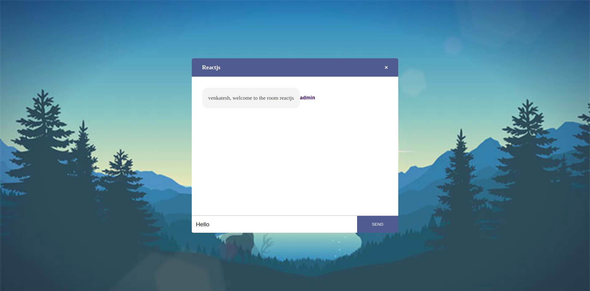
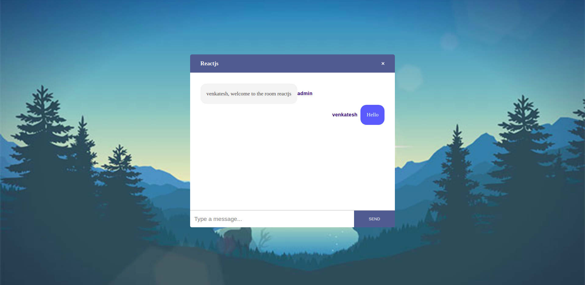
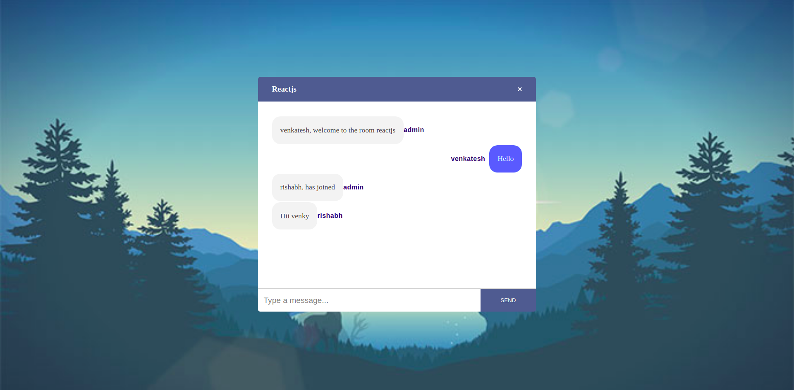
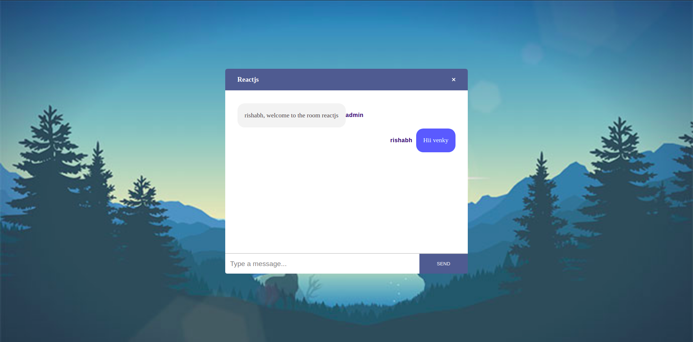

# Chat-box
### A realtime chat application built using Node.js, React.js and Socket.io.

### Many people can join the same room by entering the same room name.

### All the members in the room can see each others messages and can chat.

### Whenever a person joins the room or leaves it, everyone in the room gets notified.

### Two people with the same name cannot join the room, the joining name should be unique.

